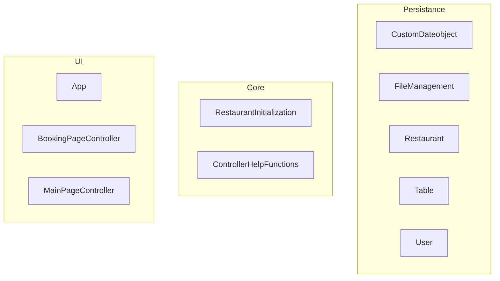

```mermaid
    graph TD

    %% Pakke: Persistance
    subgraph Persistance["Persistance"]
        A1[CustomDateobject]
        A2[FileManagement]
        A3[Restaurant]
        A4[Table]
        A5[User]

    end    


    %% Pakke: Core
    subgraph Core["Core"]
        B1[RestaurantInitialization]
        B2[ControllerHelpFunctions]
    end   

    %% Pakke: UI
    subgraph UI["UI"]
        C1[App]
        C2[BookingPageController]
        C3[MainPageController]
    end 
```