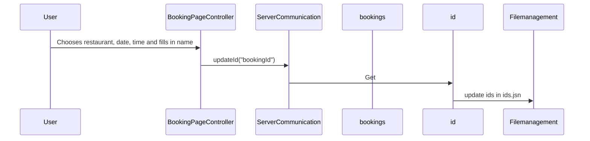

```mermaid 

sequenceDiagram
    participant User
    participant BookingPageController
    participant ServerCommunication
    participant bookings
    participant id
    participant Filemanagement

    User->>BookingPageController: Chooses restaurant, date, time and fills in name
    BookingPageController->>ServerCommunication: updateId("bookingId")
    ServerCommunication->>id:Get
    id->>Filemanagement: update ids in ids.jsn
    
```