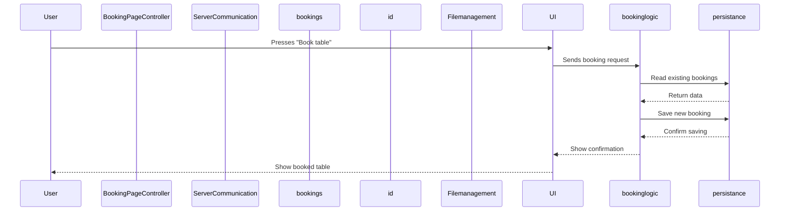

```mermaid 

sequenceDiagram
    participant User
    participant BookingPageController
    participant ServerCommunication
    participant bookings
    participant id
    participant Filemanagement

    User->>UI: Presses "Book table"
    UI->>bookinglogic: Sends booking request
    bookinglogic->>persistance: Read existing bookings
    persistance-->>bookinglogic: Return data
    bookinglogic->>persistance: Save new booking
    persistance-->>bookinglogic: Confirm saving
    bookinglogic-->>UI: Show confirmation
    UI-->>User: Show booked table

```