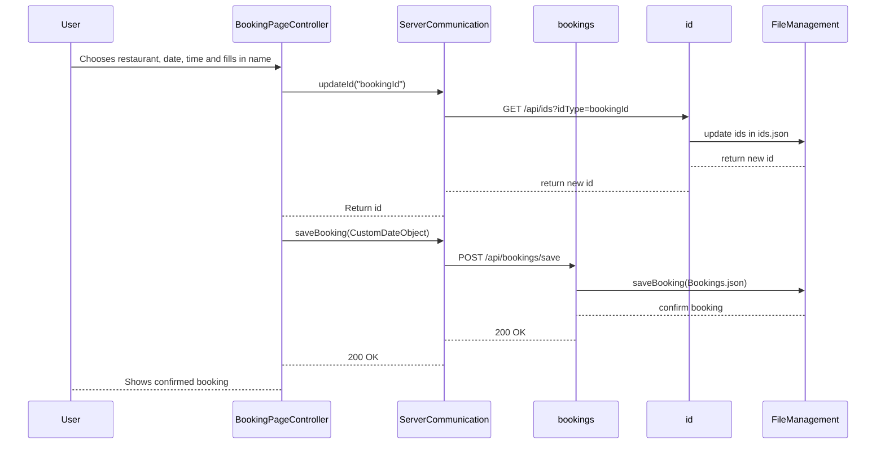

```mermaid 

sequenceDiagram
    participant User
    participant BookingPageController
    participant ServerCommunication
    participant bookings
    participant id
    participant FileManagement

    User->>BookingPageController: Chooses restaurant, date, time and fills in name
    BookingPageController->>ServerCommunication: updateId("bookingId")
    ServerCommunication->>id: GET /api/ids?idType=bookingId
    id->>FileManagement: update ids in ids.json
    FileManagement-->id: return new id
    id-->ServerCommunication: return new id
    ServerCommunication-->BookingPageController: Return id
    BookingPageController->>ServerCommunication: saveBooking(CustomDateObject)
    ServerCommunication->>bookings: POST /api/bookings/save
    bookings->>FileManagement: saveBooking(Bookings.json)
    FileManagement-->bookings: confirm booking
    bookings-->ServerCommunication: 200 OK
    ServerCommunication-->BookingPageController: 200 OK
    BookingPageController-->User: Shows confirmed booking
    
```