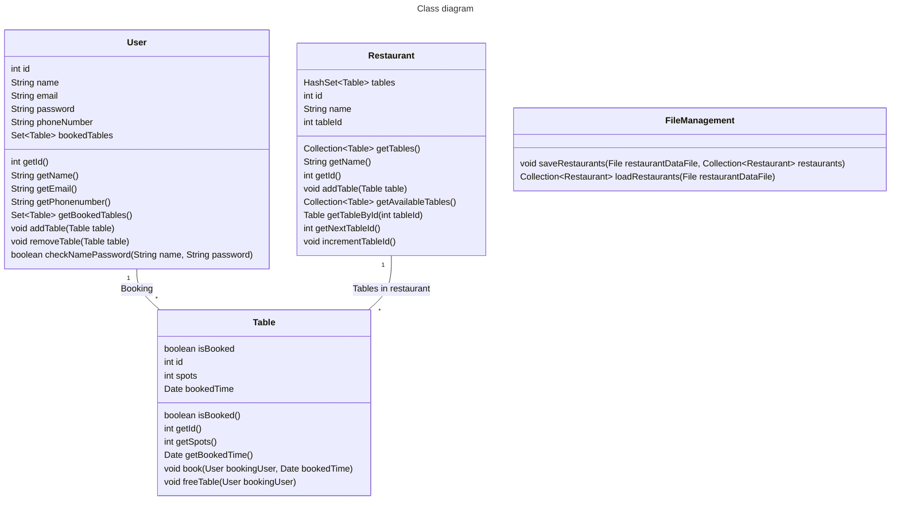

```mermaid
---
title: Class diagram
---

classDiagram
    class Table{
        boolean isBooked
        int id
        int spots
        Date bookedTime

        boolean isBooked()
        int getId()
        int getSpots()
        Date getBookedTime()
        void book(User bookingUser, Date bookedTime)
        void freeTable(User bookingUser)
    }

    class User{
        int id
        String name
        String email
        String password
        String phoneNumber
        Set&lt;Table&gt bookedTables

        int getId()
        String getName()
        String getEmail()
        String getPhonenumber()
        Set&lt;Table&gt getBookedTables()
        void addTable(Table table)
        void removeTable(Table table)
        boolean checkNamePassword(String name, String password)
    }

    class Restaurant{
        
        HashSet&lt;Table&gt; tables
        int id
        String name
        int tableId


        Collection&lt;Table&gt getTables()
        String getName()
        int getId()
        void addTable(Table table)
        Collection&lt;Table&gt getAvailableTables()
        Table getTableById(int tableId)
        int getNextTableId()
        void incrementTableId()
    }

    class FileManagement{

        void saveRestaurants(File restaurantDataFile, Collection&lt;Restaurant&gt restaurants)
        Collection&lt;Restaurant&gt loadRestaurants(File restaurantDataFile)
    }

    User "1" -- "*" Table : Booking
    Restaurant "1" -- "*" Table : Tables in restaurant
```