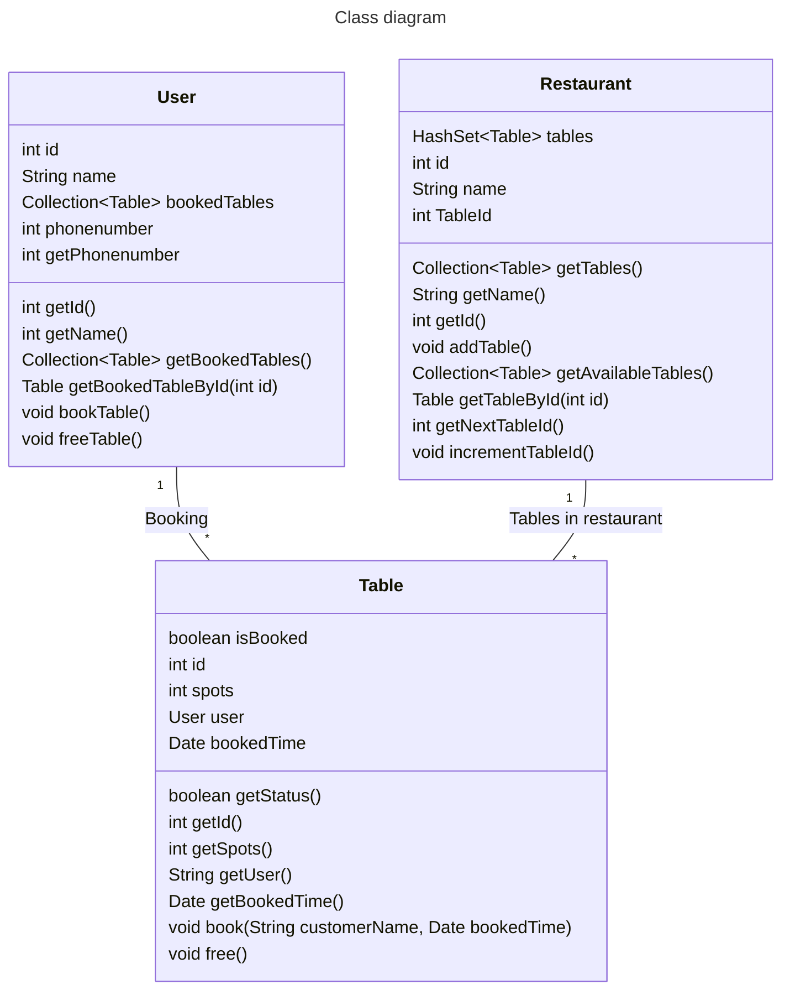

```mermaid
---
title: Class diagram
---

classDiagram
    class Table{
        boolean isBooked
        int id
        int spots
        User user
        Date bookedTime

        boolean getStatus()
        int getId()
        int getSpots()
        String getUser()
        Date getBookedTime()
        void book(String customerName, Date bookedTime)
        void free()
    }

    class User{
        int id
        String name
        Collection&lt;Table&gt bookedTables
        int phonenumber

        int getId()
        int getName()
        Collection&lt;Table&gt getBookedTables()
        Table getBookedTableById(int id)
        int getPhonenumber
        void bookTable()
        void freeTable()
    }

    class Restaurant{
        
        HashSet&lt;Table&gt; tables
        int id
        String name
        int TableId


        Collection&lt;Table&gt getTables()
        String getName()
        int getId()
        void addTable()
        Collection&lt;Table&gt getAvailableTables()
        Table getTableById(int id)
        int getNextTableId()
        void incrementTableId()
    }

    User "1" -- "*" Table : Booking
    Restaurant "1" -- "*" Table : Tables in restaurant
```