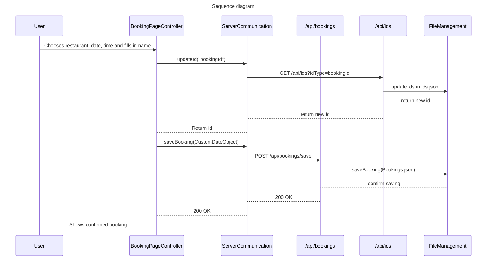

```mermaid 
---
title: Sequence diagram
---

sequenceDiagram
    participant User
    participant BookingPageController
    participant ServerCommunication
    participant bookings as /api/bookings 
    participant ids as /api/ids
    participant FileManagement

    User->>BookingPageController: Chooses restaurant, date, time and fills in name
    BookingPageController->>ServerCommunication: updateId("bookingId")
    ServerCommunication->>ids: GET /api/ids?idType=bookingId
    ids->>FileManagement: update ids in ids.json
    FileManagement-->ids: return new id
    ids-->ServerCommunication: return new id
    ServerCommunication-->BookingPageController: Return id
    BookingPageController->>ServerCommunication: saveBooking(CustomDateObject)
    ServerCommunication->>bookings: POST /api/bookings/save
    bookings->>FileManagement: saveBooking(Bookings.json)
    FileManagement-->bookings: confirm saving
    bookings-->ServerCommunication: 200 OK
    ServerCommunication-->BookingPageController: 200 OK
    BookingPageController-->User: Shows confirmed booking
    
```

**[Back to root README](../../README.md)**